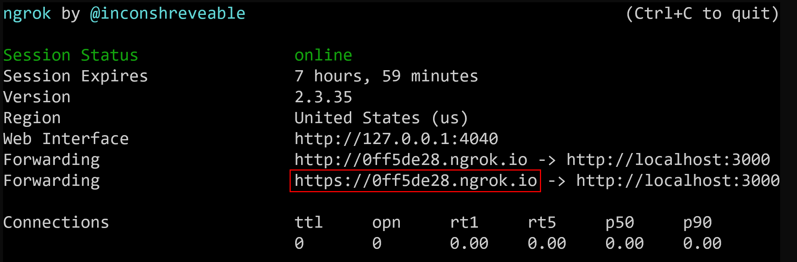

# Express

According to the official homepage Express is a minimal and flexible Node.js web application framework that provides a robust set of features for web and mobile applications.

For more details see http://expressjs.com/.

## Installation

[Here](https://expressjs.com/en/starter/installing.html) you find a tutorial how to install Express.

## ngrok

To get a public URL to your local webserver (e.g. for testing) you can use [ngrok](https://ngrok.com/).

Install ngrok globally:

```bash
npm install ngrok -g
```

Use ngrok to get a URL for http requests to port 3000:

```bash
ngrok http 3000
```



## HTTP Caching

If you reload the page and analyze the networt traffic (e.g. with Chrome DevTools) you can see that the webserver responses with HTTP Statuscode 304 ("Not Modified"). In this way the webserver tells the client, that the requested ressource has not changed. So the client can use the already cached resource.

To validate whether a cached resource is still up-to-date, Express uses ETags. For further information about HTTP Caching and ETags read [this post](https://developers.google.com/web/fundamentals/performance/optimizing-content-efficiency/http-caching?hl=de).
